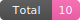

<h1 align="center">Hello there 👋, I'm Kat</h1>
<h3 align="center">A STEM student living between the USA and Mexico</h3>

  

<h2>🎧 Study Dashboard</h2>

<h3>📚 Now studying</h3>

  Python & Data Tools ███████░░░ 70%  
  Git/GitHub █████░░░░░ 50%  
  SQL ███░░░░░░░░░ 30%

<h3>🎵 Current study song</h3>

  <a href="https://open.spotify.com/" target="_blank" rel="noreferrer">🔗 Open Spotify</a>

<h3>🥤 Energy Drink Tower</h3>

  <b>Total energy drinks to date:</b>
  

<b>Pick a flavor:</b>

  <a href="https://github.com/katuhiel-dev/katuhiel-dev/issues/new?title=add-drink:original">Original</a> ·
  <a href="https://github.com/katuhiel-dev/katuhiel-dev/issues/new?title=add-drink:ultra-zero">Ultra Zero</a> ·
  <a href="https://github.com/katuhiel-dev/katuhiel-dev/issues/new?title=add-drink:electric-blue">Electric Blue</a> ·
  <a href="https://github.com/katuhiel-dev/katuhiel-dev/issues/new?title=add-drink:sunrise">Sunrise</a> ·
  <a href="https://github.com/katuhiel-dev/katuhiel-dev/issues/new?title=add-drink:ultra-black">Ultra Black</a> ·
  <a href="https://github.com/katuhiel-dev/katuhiel-dev/issues/new?title=add-drink:rosa">Rosa</a> ·
  <a href="https://github.com/katuhiel-dev/katuhiel-dev/issues/new?title=add-drink:paradise">Paradise</a>

  <b>This week’s tower:</b> 
  

<h3 align="left">Connect with me:</h3>

  

<h3 align="left">Languages and Tools:</h3>

  
  
  
  
  

